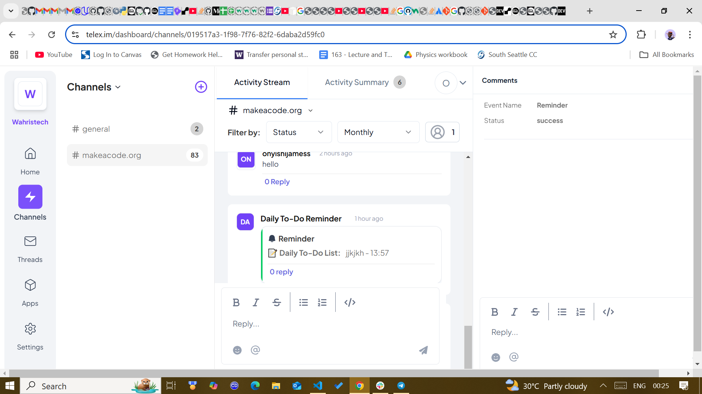
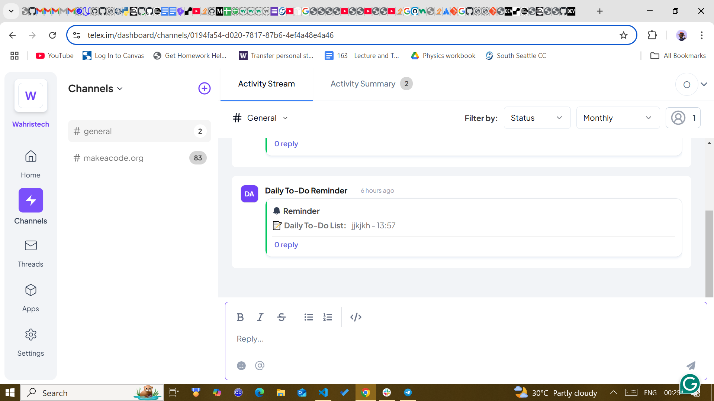
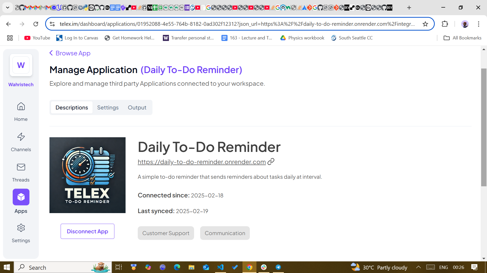
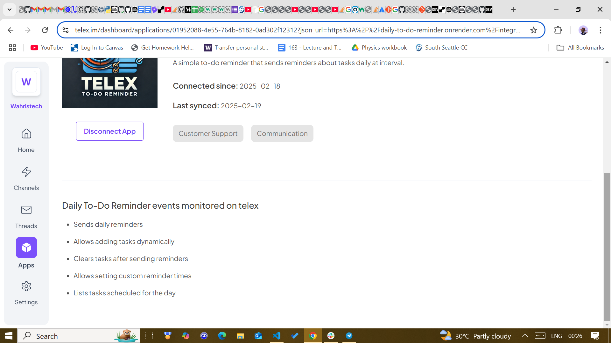
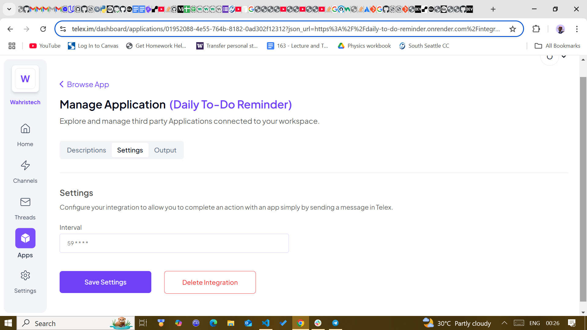

# DAILY TO DO REMINDER INTEGRATION 

## Introduction
The Daily-To-Do Reminder posts created tasks for each day to the Organizations Channels at intervals on the Telex platform. It checks the availability of tasks scheduled and sends the results to the specified return URL (which is a Telex channel URL).

This is an interval integration so you have to define an interval in the settings for it to work. The default settings specify an interval field so when it is added to your organisation, you can go ahead to modify it. 

## Setting Up

1. Clone the repository:

```bash
git clone https://github.com/telexintegrations/daily-to-do-reminder.git
cd daily-to-do-reminder
```

2. Create a virtual environment:

```bash
python -m venv venv
source venv/bin/activate  # On Windows: venv\Scripts\activate
```

3. Install dependencies:

```bash
pip install -r requirements.txt
```
## Environment Variables
Create a `.env` file and add the following:

DEFAULT_REMINDER_TIME =  your_default_reminder_time

## Running the Application

1. Start the server:

```bash
uvicorn main:app
```

2. Access the API documentation:

- Swagger UI: http://localhost:8000/docs
- ReDoc: http://localhost:8000/redoc


## API Endpoints

### Daily To-Do Reminder

- `GET /` - homepage
- `GET /list-tasks` - Get all tasks for today
- `POST /add-task` - Create a new task
- `POST /tick` - gets triggered by telex at intervals 
- `GET  /integration-json` - contains a required json format for integration to telex

The server should now be running and accessible at `http://localhost:8000`.

## Integration JSON

The integration JSON file defined at the route `/integration.json` defines all the details needed for this integration to work on Telex. Since it is an interval integration that doesn't need data, it only exposes a /tick endpoint. Telex will call this endpoint according to the cron interval defined in the settings. The JSON snippet below shows the integration json for the deployed url at: https://daily-to-do-reminder.onrender.com/integration-json. If you deploy it somewhere else, the `app_url`, `website`, and `tick_url` will be updated. 

```json
{
  "data": {
    "date": {
      "created_at": "2025-02-18",
      "updated_at": "2025-02-19"
    },
    "descriptions": {
      "app_description": "A simple to-do reminder that sends reminders about tasks daily at interval.",
      "app_logo": "https://res.cloudinary.com/dcnnysxm9/image/upload/v1739862586/to-do_reminder_xdzgb2.webp",
      "app_name": "Daily To-Do Reminder",
      "app_url": "https://daily-to-do-reminder.onrender.com",
      "background_color": "#00fbff"
    },
    "integration_category": "Project Management",
    "integration_type": "interval",
    "is_active": true,
    "key_features": [
      "Sends daily reminders",
      "Allows adding tasks dynamically",
      "Clears tasks after sending reminders",
      "Allows setting custom reminder times",
      "Lists tasks scheduled for the day"
    ],
    "author": "Onyishi James",
    "website": "https://daily-to-do-reminder.onrender.com",
    "settings": [
      {
        "label": "interval",
        "type": "text",
        "required": true,
        "default": "59 * * * *"
      }
    ],
    "endpoints": [
      {
        "path": "/add-task",
        "method": "POST",
        "description": "adds a new task and time to the reminder list"
      },
      {
        "path": "/list-tasks",
        "method": "GET",
        "description": "lists all task scheduled for that day"
      }
    ],
    "target_url": "",
    "tick_url": "https://daily-to-do-reminder.onrender.com/tick"
  }
}
```

## Request Format

The `/tick` endpoint accepts a `POST` request, when triggered by telex it returns the following json.

```json
{
  'channel_id': '019517a3-1f98-7f76-82f2-6daba2d59fc0', 
  'return_url': 'https://ping.telex.im/v1/return/019517a3-1f98-7f76-82f2-6daba2d59fc0', 
   'settings': [{
    'default': '* * * * *',
    'label': 'interval', 
    'required': True, 
    'type': 'text'
    }]
    }
```

This data will be sent by Telex each time the cron interval is reached. The default interval is defined as `59 * * * *` which means every 59 minutes according to cron-syntax. Use https://crontab.guru for help defining cron schedules. The integration reads the settings to figure out the sites that must be called immediately, then sends a response, if any, to the `return_url` provided by Telex. 


### Explanation:
- `channel_id`: The ID of the Telex channel.
- `return_url`: The URL where the daily reminders will be sent.
- `settings`: An array of settings for the daily to-do reminder. The settings are defined by the integration author and can only be used by the author. Telex only sends the settings whenever the /tick is called.

## Tests
 to run test locally: 
 1. go to terminal
 2. CD into project directory 
 3. run pytest test-to-do.py

## Deployment
The API is deployed on **Render** using **Docker** to build.

## Contributing

Contributions are welcome! 
1. Fork the repository
2. Create a new branch (`git checkout -b feature-branch`)
3. Make changes and commit (`git commit -m 'feat: Add feature'`)
4. Push to your branch (`git push origin feature-branch`)
5. Open a Pull Request


### License

This project is licensed under the **MIT License**. Feel free to use, modify, and distribute it under the terms of the license.

---
## here are some pictures from telex 








Happy To-Do-ing! 😊